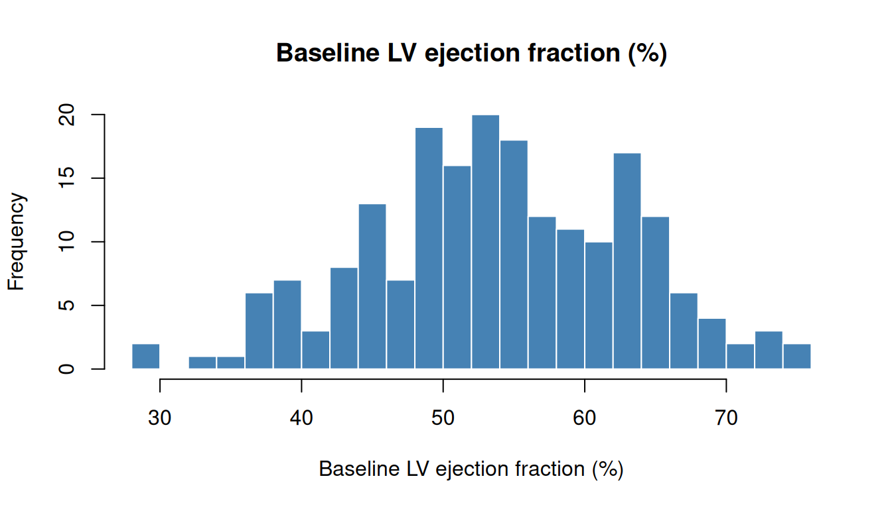

# Data Label Handling Best Practices

## Why Labels Matter

Variable labels are the bridge between raw data and human-readable
output. A column named `lvefvs_b` means nothing in a table or plot
caption, but “Baseline LV Ejection Fraction (%)” tells the reader
exactly what they are looking at. In clinical research, where results go
directly into manuscripts, grant submissions, and regulatory filings,
unlabeled output is unprofessional and error-prone.

SAS datasets carry variable labels natively. When you import them into R
with
[`haven::read_sas()`](https://haven.tidyverse.org/reference/read_sas.html),
the `labelled` package preserves those labels as column attributes.
`hvtiRutilities` provides a set of functions to extract, look up,
register, and override these labels throughout the analysis lifecycle.

``` r
if (requireNamespace("hvtiRutilities", quietly = TRUE)) {
  library("hvtiRutilities")
} else {
  pkgload::load_all(export_all = FALSE, helpers = FALSE, quiet = TRUE)
}
#> 
#>  hvtiRutilities 1.0.0.9004 
#>  
#>  Type hvtiRutilities.news() to see new features, changes, and bug fixes. 
#> 
library(labelled)
```

## The Label Lifecycle

A typical clinical analysis has four phases where labels matter:

1.  **Ingestion** — labels arrive with the data (SAS import) or need to
    be created (CSV import)
2.  **Transformation** — derived variables (ratios, bins, indices) need
    new labels
3.  **Override** — study-specific abbreviations or corrections
4.  **Consumption** — labels appear in plots, tables, and data
    dictionaries

### Phase 1: Extracting Labels at Ingestion

[`label_map()`](https://ehrlinger.github.io/hvtiRutilities/reference/label_map.md)
extracts all variable labels into a lookup table:

``` r
# Simulated SAS-style dataset with labels
dta <- generate_survival_data(n = 200, seed = 42)

lmap <- label_map(dta)
head(lmap, 10)
#>                     key                                          label
#> ccfid             ccfid                                     Patient ID
#> origin_year origin_year                 Calendar year for iv_opyrs = 0
#> iv_opyrs       iv_opyrs Observation interval (years) since origin_year
#> iv_dead         iv_dead                Follow-up time to death (years)
#> dead               dead           Death indicator (1=dead, 0=censored)
#> reop               reop                      Reoperation (1=yes, 0=no)
#> iv_reop         iv_reop          Follow-up time to reoperation (years)
#> age                 age                         Age at surgery (years)
#> sex                 sex                                            Sex
#> bmi                 bmi                        Body mass index (kg/m2)
```

The result is a two-column data frame: `key` (variable name) and `label`
(descriptive text). Every column in the data gets an entry. Unlabeled
columns fall back to the variable name itself.

#### Detecting Missing Labels

When data arrives from a plain CSV (no labels),
[`label_map()`](https://ehrlinger.github.io/hvtiRutilities/reference/label_map.md)
warns you:

``` r
csv_data <- data.frame(
  pat_id = 1:5,
  hgb = c(12.1, 14.3, 10.8, 13.5, 11.2),
  egfr = c(88, 72, 45, 91, 63)
)

# This triggers a warning --- most columns lack labels
lmap_csv <- label_map(csv_data)
#> Warning: 3 of 3 variables (100%) lack descriptive labels. Consider adding a
#> labels_overrides.yml or using add_labels().
print(lmap_csv)
#>           key  label
#> pat_id pat_id pat_id
#> hgb       hgb    hgb
#> egfr     egfr   egfr
```

The warning is intentional: it prevents the common mistake of generating
plots and tables with cryptic variable names like `hgb` and `egfr` and
not noticing until a collaborator asks what they mean.

### Phase 2: Labeling Derived Variables

After ingestion, you’ll create new variables — age groups, risk scores,
ratios, indicator flags. These variables have no labels because they
didn’t exist in the original data.

#### Method A: Label the data directly (preferred)

The best practice is to label the data frame itself using
[`add_labels()`](https://ehrlinger.github.io/hvtiRutilities/reference/add_labels.md).
Labels travel with the data through `dplyr` operations, so they are
never out of sync:

``` r
# Create derived variables
dta$age_group <- cut(dta$age,
  breaks = c(0, 30, 50, 70, Inf),
  labels = c("<30", "30-50", "50-70", ">70")
)
dta$ef_low <- dta$lvefvs_b < 40

# Label them directly on the data frame
dta <- add_labels(dta, c(
  age_group = "Age Group at Surgery",
  ef_low    = "Reduced Ejection Fraction (<40%)"
))

# Verify
var_label(dta$age_group)
#> [1] "Age Group at Surgery"
var_label(dta$ef_low)
#> [1] "Reduced Ejection Fraction (<40%)"
```

When you label the data directly, any subsequent call to
[`label_map()`](https://ehrlinger.github.io/hvtiRutilities/reference/label_map.md)
automatically picks up the new labels:

``` r
lmap <- label_map(dta)
lmap[lmap$key %in% c("age_group", "ef_low"), ]
#>                 key                            label
#> age_group age_group             Age Group at Surgery
#> ef_low       ef_low Reduced Ejection Fraction (<40%)
```

#### Method B: Update the label map (for reporting)

Sometimes the label map is created once and passed to a reporting module
that generates tables and figures. In that case, update the map
directly:

``` r
# Start from the base data
lmap <- label_map(generate_survival_data(n = 100, seed = 7))

# Register labels for variables you plan to create
lmap <- add_labels(lmap, c(
  age_group  = "Age Group at Surgery",
  ef_low     = "Reduced Ejection Fraction (<40%)",
  risk_score = "Composite Risk Score"
))

tail(lmap, 4)
#>                       key                            label
#> hypertension hypertension                     Hypertension
#> 1               age_group             Age Group at Surgery
#> 2                  ef_low Reduced Ejection Fraction (<40%)
#> 3              risk_score             Composite Risk Score
```

#### Which method should I use?

| Scenario                              | Method                  | Reason                                 |
|---------------------------------------|-------------------------|----------------------------------------|
| Adding columns to a data frame        | `add_labels(data, ...)` | Labels travel with the data            |
| Building a reporting table/dictionary | `add_labels(lmap, ...)` | The map is the artifact being consumed |
| Quick lookup for a plot title         | `get_label(lmap, var)`  | Safe, readable, errors on typos        |

### Phase 3: Study-Specific Overrides

Different studies use different abbreviations and naming conventions. An
AVSD study might want “Common AVV” shortened to “CAVV”; a mitral valve
study might need different terminology entirely. Hard-coding these
replacements in shared functions is fragile.

[`apply_label_overrides()`](https://ehrlinger.github.io/hvtiRutilities/reference/apply_label_overrides.md)
reads a YAML file and applies the overrides to a label map. If the file
doesn’t exist, nothing happens — making it safe to call unconditionally.

``` r
# Create a study-specific overrides file
tmp_overrides <- tempfile(fileext = ".yml")
writeLines(c(
  "lvefvs_b: 'Baseline LVEF (%)'",
  "hgb_bs: 'Hemoglobin (g/dL)'",
  "gfr_bs: 'eGFR (mL/min/1.73m2)'",
  "nyha_class: 'NYHA Class'"
), tmp_overrides)

# Start with the default labels
lmap <- label_map(generate_survival_data(n = 50, seed = 1))

# Apply study-specific overrides
lmap <- apply_label_overrides(lmap, overrides_file = tmp_overrides)
lmap[lmap$key %in% c("lvefvs_b", "hgb_bs", "gfr_bs", "nyha_class"), ]
#>                   key                label
#> hgb_bs         hgb_bs    Hemoglobin (g/dL)
#> gfr_bs         gfr_bs eGFR (mL/min/1.73m2)
#> lvefvs_b     lvefvs_b    Baseline LVEF (%)
#> nyha_class nyha_class           NYHA Class
```

In a real project, `labels_overrides.yml` lives alongside `config.yml`
in the project root and is committed to version control. Each study gets
its own file; shared analysis code never contains hard-coded label
replacements.

#### Example `labels_overrides.yml`

``` yaml
# AVSD study label overrides
cavv_area: "Common AVV Area (cm2)"
ed_area: "End-Diastolic Area (cm2)"
es_area: "End-Systolic Area (cm2)"
bsa_idx: "BSA-Indexed Value"
```

### Phase 4: Using Labels in Output

#### Safe single-variable lookup with `get_label()`

The
[`get_label()`](https://ehrlinger.github.io/hvtiRutilities/reference/get_label.md)
function replaces the error-prone
[`match()`](https://rdrr.io/r/base/match.html) pattern. It errors on
typos instead of silently returning `NA`:

``` r
lmap <- label_map(generate_survival_data(n = 50, seed = 42))

# Use in plot titles
get_label(lmap, "age")
#> [1] "Age at surgery (years)"
get_label(lmap, "lvefvs_b")
#> [1] "Baseline LV ejection fraction (%)"
```

``` r
# Typo --- clear error instead of silent NA
get_label(lmap, "ages")
#> Error:
#> ! Variable 'ages' not found in label map.
```

#### Building a data dictionary

Use
[`data_dictionary()`](https://ehrlinger.github.io/hvtiRutilities/reference/data_dictionary.md)
to generate a complete, type-annotated data dictionary in one call:

``` r
dta <- generate_survival_data(n = 200, seed = 42)
dict <- data_dictionary(dta)
head(dict, 12)
#>                variable                                          label
#> ccfid             ccfid                                     Patient ID
#> origin_year origin_year                 Calendar year for iv_opyrs = 0
#> iv_opyrs       iv_opyrs Observation interval (years) since origin_year
#> iv_dead         iv_dead                Follow-up time to death (years)
#> dead               dead           Death indicator (1=dead, 0=censored)
#> reop               reop                      Reoperation (1=yes, 0=no)
#> iv_reop         iv_reop          Follow-up time to reoperation (years)
#> age                 age                         Age at surgery (years)
#> sex                 sex                                            Sex
#> bmi                 bmi                        Body mass index (kg/m2)
#> hgb_bs           hgb_bs                     Baseline hemoglobin (g/dL)
#> wbc_bs           wbc_bs                      Baseline WBC count (K/uL)
#>                 class n_unique pct_missing
#> ccfid       character      200         0.0
#> origin_year   integer       21         0.0
#> iv_opyrs      numeric      183         0.0
#> iv_dead       numeric      184         0.0
#> dead          integer        2         0.0
#> reop          integer        2         0.0
#> iv_reop       numeric       31        83.5
#> age           numeric      165         0.0
#> sex            factor        2         0.0
#> bmi           numeric      123         0.0
#> hgb_bs        numeric       66         0.0
#> wbc_bs        numeric      172         0.0
#>                                                                  summary
#> ccfid       200 levels: PT00001, PT00002, PT00003, PT00004, PT00005, ...
#> origin_year                                           1998 / 2008 / 2018
#> iv_opyrs                                             1.06 / 7.87 / 14.99
#> iv_dead                                               0.25 / 4.1 / 13.98
#> dead                                                           0 / 1 / 1
#> reop                                                           0 / 0 / 1
#> iv_reop                                               0.04 / 1.29 / 9.92
#> age                                                       1 / 44.75 / 85
#> sex                                               2 levels: Female, Male
#> bmi                                                    15 / 26.65 / 41.8
#> hgb_bs                                                     7.6 / 13 / 18
#> wbc_bs                                                1.5 / 7.35 / 15.53
```

#### Labels in summary tables

Use
[`get_labels()`](https://ehrlinger.github.io/hvtiRutilities/reference/get_labels.md)
(vectorized) to look up multiple labels at once:

``` r
lmap <- label_map(dta)

# Numeric summary with labels
num_vars <- c("age", "bmi", "hgb_bs", "gfr_bs", "lvefvs_b")
summary_tbl <- data.frame(
  variable = num_vars,
  label    = get_labels(lmap, num_vars),
  mean     = vapply(num_vars, function(v) round(mean(dta[[v]]), 1), numeric(1)),
  sd       = vapply(num_vars, function(v) round(sd(dta[[v]]), 1), numeric(1)),
  median   = vapply(num_vars, function(v) round(median(dta[[v]]), 1), numeric(1))
)
print(summary_tbl)
#>          variable                             label mean   sd median
#> age           age            Age at surgery (years) 44.6 14.6   44.8
#> bmi           bmi           Body mass index (kg/m2) 26.8  4.8   26.6
#> hgb_bs     hgb_bs        Baseline hemoglobin (g/dL) 12.9  1.8   13.0
#> gfr_bs     gfr_bs     Baseline eGFR (mL/min/1.73m2) 76.2 19.4   75.8
#> lvefvs_b lvefvs_b Baseline LV ejection fraction (%) 54.0  9.2   53.8
```

#### Labels in plots

``` r
var <- "lvefvs_b"
hist(dta[[var]],
  main = get_label(lmap, var),
  xlab = get_label(lmap, var),
  col  = "steelblue",
  border = "white",
  breaks = 20
)
```



## Complete Workflow

Putting it all together — a realistic analysis setup:

``` r
# 1. Load data (simulated here; in practice: haven::read_sas())
dta <- generate_survival_data(n = 500, seed = 2024)

# 2. Convert types
dta_clean <- r_data_types(dta,
  factor_size = 5,
  skip_vars   = c("ccfid", "iv_dead", "iv_reop", "iv_opyrs")
)

# 3. Create derived variables with labels
dta_clean$age_group <- cut(dta_clean$age,
  breaks = c(0, 30, 50, 70, Inf),
  labels = c("<30", "30-50", "50-70", ">70")
)
dta_clean$ef_category <- cut(dta_clean$lvefvs_b,
  breaks = c(0, 35, 50, Inf),
  labels = c("Reduced", "Borderline", "Normal")
)
dta_clean <- add_labels(dta_clean, c(
  age_group   = "Age Group at Surgery",
  ef_category = "Ejection Fraction Category"
))

# 4. Extract label map for reporting
lmap <- label_map(dta_clean)

# 5. Verify: all variables have real labels
stopifnot(!any(lmap$key == lmap$label))

# 6. Summary using labels
cat("Variables:", nrow(lmap), "\n")
#> Variables: 26
cat("All labeled:", !any(lmap$key == lmap$label), "\n")
#> All labeled: TRUE
head(lmap, 10)
#>                     key                                          label
#> ccfid             ccfid                                     Patient ID
#> origin_year origin_year                 Calendar year for iv_opyrs = 0
#> iv_opyrs       iv_opyrs Observation interval (years) since origin_year
#> iv_dead         iv_dead                Follow-up time to death (years)
#> dead               dead           Death indicator (1=dead, 0=censored)
#> reop               reop                      Reoperation (1=yes, 0=no)
#> iv_reop         iv_reop          Follow-up time to reoperation (years)
#> age                 age                         Age at surgery (years)
#> sex                 sex                                            Sex
#> bmi                 bmi                        Body mass index (kg/m2)
```

## Labels and `r_data_types()`

Labels are preserved through type conversion. This is handled
automatically — you don’t need to do anything special:

``` r
dta <- sample_data(n = 50)

# Before conversion
var_label(dta$char)
#> [1] "Gender"

# After conversion
dta_clean <- r_data_types(dta, skip_vars = "id")
var_label(dta_clean$char)
#> [1] "Gender"

# Labels survive the round-trip
lmap_before <- label_map(dta)
lmap_after  <- label_map(dta_clean)
identical(lmap_before, lmap_after)
#> [1] TRUE
```

## Anti-Patterns to Avoid

### 1. Hard-coded label replacements in shared code

``` r
# BAD: study-specific logic in shared helper
clean_labels <- function(labels) {
  labels$label <- gsub("Common AVV", "CAVV", labels$label)
  labels$label <- gsub("End-distole", "End-Diastolic", labels$label)
  labels
}
```

This breaks the moment anyone uses the code for a different study. Use
[`apply_label_overrides()`](https://ehrlinger.github.io/hvtiRutilities/reference/apply_label_overrides.md)
with a per-study YAML file instead.

### 2. Creating derived variables without labels

``` r
# BAD: new column has no label
dta$risk_score <- dta$age * 0.1 + as.integer(dta$nyha_class) * 0.5

# GOOD: label it immediately
dta$risk_score <- dta$age * 0.1 + as.integer(dta$nyha_class) * 0.5
dta <- add_labels(dta, c(risk_score = "Composite Risk Score"))
```

### 3. Using `match()` without error checking

``` r
# BAD: typo returns NA silently
title <- lmap$label[match("ages", lmap$key)]  # NA, no warning

# GOOD: get_label() catches the typo
title <- get_label(lmap, "ages")  # Error: 'ages' not found in label map
```

### 4. Labeling the map instead of the data

``` r
# FRAGILE: map goes stale when you modify the data
dta$ratio <- dta$a / dta$b
lmap <- add_labels(lmap, c(ratio = "A/B Ratio"))
# ... 50 lines later, someone renames 'ratio' to 'ab_ratio'
# lmap still says "ratio" --- silent mismatch

# BETTER: label the data, extract the map later
dta$ratio <- dta$a / dta$b
dta <- add_labels(dta, c(ratio = "A/B Ratio"))
lmap <- label_map(dta)  # always in sync
```

## Function Reference

| Function                            | Purpose                                                                       |
|-------------------------------------|-------------------------------------------------------------------------------|
| `label_map(data)`                   | Extract all labels into a lookup table                                        |
| `get_label(lmap, var)`              | Look up one label with error checking                                         |
| `get_labels(lmap, vars)`            | Look up multiple labels at once (vectorized)                                  |
| `add_labels(data, labels)`          | Label a data frame or update a label map                                      |
| `apply_label_overrides(data, file)` | Apply study-specific overrides from YAML (works on label maps or data frames) |
| `data_dictionary(data)`             | Build a type-annotated data dictionary                                        |

## Session Information

``` r
sessionInfo()
#> R version 4.5.3 (2026-03-11)
#> Platform: x86_64-pc-linux-gnu
#> Running under: Ubuntu 24.04.4 LTS
#> 
#> Matrix products: default
#> BLAS:   /usr/lib/x86_64-linux-gnu/openblas-pthread/libblas.so.3 
#> LAPACK: /usr/lib/x86_64-linux-gnu/openblas-pthread/libopenblasp-r0.3.26.so;  LAPACK version 3.12.0
#> 
#> locale:
#>  [1] LC_CTYPE=C.UTF-8       LC_NUMERIC=C           LC_TIME=C.UTF-8       
#>  [4] LC_COLLATE=C.UTF-8     LC_MONETARY=C.UTF-8    LC_MESSAGES=C.UTF-8   
#>  [7] LC_PAPER=C.UTF-8       LC_NAME=C              LC_ADDRESS=C          
#> [10] LC_TELEPHONE=C         LC_MEASUREMENT=C.UTF-8 LC_IDENTIFICATION=C   
#> 
#> time zone: UTC
#> tzcode source: system (glibc)
#> 
#> attached base packages:
#> [1] stats     graphics  grDevices utils     datasets  methods   base     
#> 
#> other attached packages:
#> [1] labelled_2.16.0           hvtiRutilities_1.0.0.9004
#> 
#> loaded via a namespace (and not attached):
#>  [1] vctrs_0.7.2      cli_3.6.5        knitr_1.51       rlang_1.1.7     
#>  [5] xfun_0.57        forcats_1.0.1    haven_2.5.5      generics_0.1.4  
#>  [9] jsonlite_2.0.0   glue_1.8.0       htmltools_0.5.9  hms_1.1.4       
#> [13] rmarkdown_2.31   evaluate_1.0.5   tibble_3.3.1     fastmap_1.2.0   
#> [17] yaml_2.3.12      lifecycle_1.0.5  compiler_4.5.3   dplyr_1.2.0     
#> [21] pkgconfig_2.0.3  digest_0.6.39    R6_2.6.1         tidyselect_1.2.1
#> [25] pillar_1.11.1    magrittr_2.0.4   tools_4.5.3      withr_3.0.2
```
