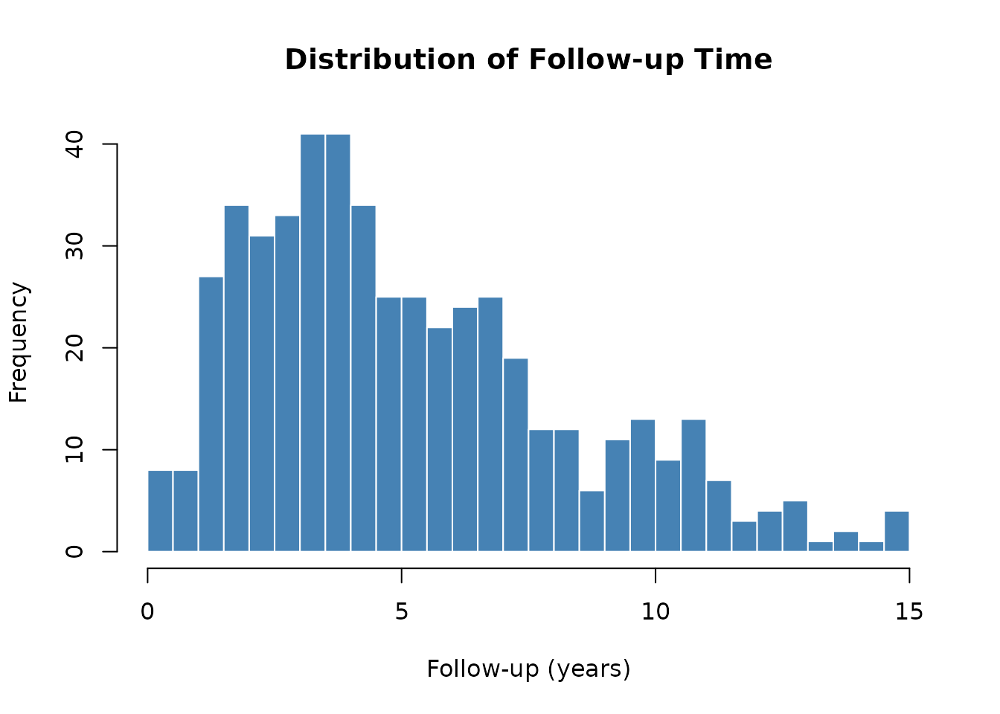

# Simulating Cardiac Surgery Survival Data

## Overview

The
[`generate_survival_data()`](https://ehrlinger.github.io/hvtiRutilities/reference/generate_survival_data.md)
function creates a realistic synthetic cardiac surgery cohort suitable
for testing and demonstrating survival analysis workflows. Survival
times are drawn from a Weibull distribution with a linear predictor
built from clinical variables (LVEF, age, hemoglobin, NYHA class, eGFR),
and administrative censoring is applied at up to 15 years.

``` r
library(hvtiRutilities)
#> 
#>  hvtiRutilities 0.2.0 
#>  
#>  Type hvtiRutilities.news() to see new features, changes, and bug fixes. 
#> 
```

## Generating the Dataset

``` r
set.seed(42)
dta <- generate_survival_data(n = 500, seed = 1024)

dim(dta)
#> [1] 500  22
names(dta)
#>  [1] "ccfid"        "iv_dead"      "dead"         "reop"         "iv_reop"     
#>  [6] "age"          "sex"          "bmi"          "hgb_bs"       "wbc_bs"      
#> [11] "plate_bs"     "gfr_bs"       "lvefvs_b"     "lvmass_b"     "lvmsi_b"     
#> [16] "stvoli_b"     "stvold_b"     "bypass_time"  "xclamp_time"  "nyha_class"  
#> [21] "diabetes"     "hypertension"
```

The dataset contains 22 columns covering patient identifiers, survival
outcomes, reoperation, demographics, pre-operative labs, cardiac
function, and surgical variables.

## Data Structure

``` r
str(dta)
#> 'data.frame':    500 obs. of  22 variables:
#>  $ ccfid       : chr  "PT00001" "PT00002" "PT00003" "PT00004" ...
#>   ..- attr(*, "label")= chr "Patient ID"
#>  $ iv_dead     : num  5.13 4.03 10.51 12.84 3.17 ...
#>   ..- attr(*, "label")= chr "Follow-up time to death (years)"
#>  $ dead        : int  0 0 0 0 0 0 1 0 1 0 ...
#>   ..- attr(*, "label")= chr "Death indicator (1=dead, 0=censored)"
#>  $ reop        : int  1 0 1 0 0 0 0 0 0 0 ...
#>   ..- attr(*, "label")= chr "Reoperation (1=yes, 0=no)"
#>  $ iv_reop     : num  0.37 NA 1.08 NA NA NA NA NA NA NA ...
#>   ..- attr(*, "label")= chr "Follow-up time to reoperation (years)"
#>  $ age         : num  33.3 39.2 14.5 30.3 48.7 13.4 39.3 76.1 60.4 52.1 ...
#>   ..- attr(*, "label")= chr "Age at surgery (years)"
#>  $ sex         : Factor w/ 2 levels "Female","Male": 1 1 1 1 1 2 2 1 1 1 ...
#>   ..- attr(*, "label")= chr "Sex"
#>  $ bmi         : num  33.3 25.9 28.5 29.2 20.8 25.3 34.3 26 19.2 27.2 ...
#>   ..- attr(*, "label")= chr "Body mass index (kg/m2)"
#>  $ hgb_bs      : num  15.3 10.1 15.4 11.7 9.8 9.8 9.6 15.7 15.7 13.1 ...
#>   ..- attr(*, "label")= chr "Baseline hemoglobin (g/dL)"
#>  $ wbc_bs      : num  1.5 10.37 3.29 6.37 10.99 ...
#>   ..- attr(*, "label")= chr "Baseline WBC count (K/uL)"
#>  $ plate_bs    : num  102 245 279 294 190 193 120 107 299 219 ...
#>   ..- attr(*, "label")= chr "Baseline platelet count (K/uL)"
#>  $ gfr_bs      : num  79.6 82.6 89 87 95.4 40.3 31.9 80.2 72.1 87.7 ...
#>   ..- attr(*, "label")= chr "Baseline eGFR (mL/min/1.73m2)"
#>  $ lvefvs_b    : num  56.8 58.3 67.9 55.1 62.6 59.3 55.8 58 75 41.8 ...
#>   ..- attr(*, "label")= chr "Baseline LV ejection fraction (%)"
#>  $ lvmass_b    : num  164 140 148 119 224 ...
#>   ..- attr(*, "label")= chr "Baseline LV mass (g)"
#>  $ lvmsi_b     : num  40 40 40 40 40 40 40 40 40 40 ...
#>   ..- attr(*, "label")= chr "Baseline LV mass index (g/m2)"
#>  $ stvoli_b    : num  74.1 30.9 35.9 62.6 59.2 55.7 62.9 64.1 76.3 66.2 ...
#>   ..- attr(*, "label")= chr "Baseline SV index - systolic (mL/m2)"
#>  $ stvold_b    : num  109.8 89.2 73.4 77.6 94.9 ...
#>   ..- attr(*, "label")= chr "Baseline SV index - diastolic (mL/m2)"
#>  $ bypass_time : num  102 92 47 79 75 34 51 44 110 72 ...
#>   ..- attr(*, "label")= chr "Cardiopulmonary bypass time (min)"
#>  $ xclamp_time : num  63 63 28 55 46 20 28 26 81 54 ...
#>   ..- attr(*, "label")= chr "Aortic cross-clamp time (min)"
#>  $ nyha_class  : Ord.factor w/ 4 levels "I"<"II"<"III"<..: 1 2 2 2 2 1 3 1 4 2 ...
#>   ..- attr(*, "label")= chr "NYHA functional class"
#>  $ diabetes    : Factor w/ 2 levels "No","Yes": 1 2 1 2 2 2 1 1 1 1 ...
#>   ..- attr(*, "label")= chr "Diabetes mellitus"
#>  $ hypertension: Factor w/ 2 levels "No","Yes": 2 1 1 1 1 1 1 2 1 2 ...
#>   ..- attr(*, "label")= chr "Hypertension"
```

Key columns:

| Column    | Description                                         |
|-----------|-----------------------------------------------------|
| `ccfid`   | Patient identifier                                  |
| `iv_dead` | Observed follow-up time (years)                     |
| `dead`    | Event indicator (1 = death, 0 = censored)           |
| `reop`    | Reoperation indicator                               |
| `iv_reop` | Time to reoperation (years; `NA` if no reoperation) |

## Outcome Summary

``` r
# Event rates
cat("Death rate:       ", round(mean(dta$dead), 3), "\n")
#> Death rate:        0.54
cat("Reoperation rate: ", round(mean(dta$reop), 3), "\n")
#> Reoperation rate:  0.18

# Follow-up distribution
summary(dta$iv_dead)
#>    Min. 1st Qu.  Median    Mean 3rd Qu.    Max. 
#>   0.060   2.783   4.383   5.149   6.915  14.896
```

``` r
hist(
  dta$iv_dead,
  breaks = 30,
  main = "Distribution of Follow-up Time",
  xlab = "Follow-up (years)",
  col = "steelblue",
  border = "white"
)
```



## Integration with `r_data_types()` and `label_map()`

The dataset arrives with variable labels attached and several columns
that benefit from type conversion. The
[`r_data_types()`](https://ehrlinger.github.io/hvtiRutilities/reference/r_data_types.md)
function handles these automatically.

``` r
# Convert types: keep IDs and continuous outcomes as-is
model_data <- r_data_types(
  dta,
  factor_size = 5,
  skip_vars = c("ccfid", "iv_dead", "iv_reop")
)

str(model_data[, c("dead", "reop", "sex", "nyha_class", "diabetes", "hypertension")])
#> 'data.frame':    500 obs. of  6 variables:
#>  $ dead        : logi  FALSE FALSE FALSE FALSE FALSE FALSE ...
#>   ..- attr(*, "label")= chr "Death indicator (1=dead, 0=censored)"
#>  $ reop        : logi  TRUE FALSE TRUE FALSE FALSE FALSE ...
#>   ..- attr(*, "label")= chr "Reoperation (1=yes, 0=no)"
#>  $ sex         : Factor w/ 2 levels "Female","Male": 1 1 1 1 1 2 2 1 1 1 ...
#>   ..- attr(*, "label")= chr "Sex"
#>  $ nyha_class  : Ord.factor w/ 4 levels "I"<"II"<"III"<..: 1 2 2 2 2 1 3 1 4 2 ...
#>   ..- attr(*, "label")= chr "NYHA functional class"
#>  $ diabetes    : Factor w/ 2 levels "No","Yes": 1 2 1 2 2 2 1 1 1 1 ...
#>   ..- attr(*, "label")= chr "Diabetes mellitus"
#>  $ hypertension: Factor w/ 2 levels "No","Yes": 2 1 1 1 1 1 1 2 1 2 ...
#>   ..- attr(*, "label")= chr "Hypertension"
```

After conversion:

- `dead` and `reop` (2 unique values) → `logical`
- `sex`, `diabetes`, `hypertension` (character) → `factor`
- `nyha_class` was already an ordered `factor`

### Extracting Variable Labels

``` r
lmap <- label_map(model_data)
print(lmap)
#>                       key                                 label
#> ccfid               ccfid                            Patient ID
#> iv_dead           iv_dead       Follow-up time to death (years)
#> dead                 dead  Death indicator (1=dead, 0=censored)
#> reop                 reop             Reoperation (1=yes, 0=no)
#> iv_reop           iv_reop Follow-up time to reoperation (years)
#> age                   age                Age at surgery (years)
#> sex                   sex                                   Sex
#> bmi                   bmi               Body mass index (kg/m2)
#> hgb_bs             hgb_bs            Baseline hemoglobin (g/dL)
#> wbc_bs             wbc_bs             Baseline WBC count (K/uL)
#> plate_bs         plate_bs        Baseline platelet count (K/uL)
#> gfr_bs             gfr_bs         Baseline eGFR (mL/min/1.73m2)
#> lvefvs_b         lvefvs_b     Baseline LV ejection fraction (%)
#> lvmass_b         lvmass_b                  Baseline LV mass (g)
#> lvmsi_b           lvmsi_b         Baseline LV mass index (g/m2)
#> stvoli_b         stvoli_b  Baseline SV index - systolic (mL/m2)
#> stvold_b         stvold_b Baseline SV index - diastolic (mL/m2)
#> bypass_time   bypass_time     Cardiopulmonary bypass time (min)
#> xclamp_time   xclamp_time         Aortic cross-clamp time (min)
#> nyha_class     nyha_class                 NYHA functional class
#> diabetes         diabetes                     Diabetes mellitus
#> hypertension hypertension                          Hypertension
```

The label map is useful for annotating tables and plots with descriptive
names.

## Preparing Data for Survival Analysis

``` r
# Drop admin columns to match a typical model_data setup
model_data <- model_data[, !names(model_data) %in% c("ccfid", "reop", "iv_reop")]

# Outcome variable breakdown
table(model_data$dead)
#> 
#> FALSE  TRUE 
#>   230   270
```

``` r
# Kaplan-Meier style summary by NYHA class (base R)
nyha_levels <- levels(model_data$nyha_class)

median_fu <- sapply(nyha_levels, function(lvl) {
  sub <- model_data[model_data$nyha_class == lvl, ]
  median(sub$iv_dead)
})

event_rate <- sapply(nyha_levels, function(lvl) {
  sub <- model_data[model_data$nyha_class == lvl, ]
  mean(sub$dead)
})

nyha_summary <- data.frame(
  nyha_class   = nyha_levels,
  n            = table(model_data$nyha_class),
  median_fu_yr = round(median_fu, 2),
  death_rate   = round(event_rate, 3)
)

print(nyha_summary)
#>     nyha_class n.Var1 n.Freq median_fu_yr death_rate
#> I            I      I    124         4.67      0.444
#> II          II     II    178         4.81      0.522
#> III        III    III    151         3.95      0.596
#> IV          IV     IV     47         3.45      0.681
```

## Reproducibility

The `seed` argument ensures reproducible datasets for testing:

``` r
dta_a <- generate_survival_data(n = 100, seed = 99)
dta_b <- generate_survival_data(n = 100, seed = 99)

identical(dta_a, dta_b)  # TRUE
#> [1] TRUE
```

Different seeds produce different datasets:

``` r
dta_c <- generate_survival_data(n = 100, seed = 7)
identical(dta_a, dta_c)  # FALSE
#> [1] FALSE
```

## Session Information

``` r
sessionInfo()
#> R version 4.5.2 (2025-10-31)
#> Platform: x86_64-pc-linux-gnu
#> Running under: Ubuntu 24.04.3 LTS
#> 
#> Matrix products: default
#> BLAS:   /usr/lib/x86_64-linux-gnu/openblas-pthread/libblas.so.3 
#> LAPACK: /usr/lib/x86_64-linux-gnu/openblas-pthread/libopenblasp-r0.3.26.so;  LAPACK version 3.12.0
#> 
#> locale:
#>  [1] LC_CTYPE=C.UTF-8       LC_NUMERIC=C           LC_TIME=C.UTF-8       
#>  [4] LC_COLLATE=C.UTF-8     LC_MONETARY=C.UTF-8    LC_MESSAGES=C.UTF-8   
#>  [7] LC_PAPER=C.UTF-8       LC_NAME=C              LC_ADDRESS=C          
#> [10] LC_TELEPHONE=C         LC_MEASUREMENT=C.UTF-8 LC_IDENTIFICATION=C   
#> 
#> time zone: UTC
#> tzcode source: system (glibc)
#> 
#> attached base packages:
#> [1] stats     graphics  grDevices utils     datasets  methods   base     
#> 
#> other attached packages:
#> [1] hvtiRutilities_0.2.0
#> 
#> loaded via a namespace (and not attached):
#>  [1] vctrs_0.7.1       cli_3.6.5         knitr_1.51        rlang_1.1.7      
#>  [5] xfun_0.56         forcats_1.0.1     haven_2.5.5       generics_0.1.4   
#>  [9] textshaping_1.0.4 jsonlite_2.0.0    glue_1.8.0        htmltools_0.5.9  
#> [13] ragg_1.5.0        sass_0.4.10       hms_1.1.4         rmarkdown_2.30   
#> [17] tibble_3.3.1      evaluate_1.0.5    jquerylib_0.1.4   fastmap_1.2.0    
#> [21] yaml_2.3.12       lifecycle_1.0.5   compiler_4.5.2    dplyr_1.2.0      
#> [25] fs_1.6.6          pkgconfig_2.0.3   labelled_2.16.0   systemfonts_1.3.1
#> [29] digest_0.6.39     R6_2.6.1          tidyselect_1.2.1  pillar_1.11.1    
#> [33] magrittr_2.0.4    bslib_0.10.0      withr_3.0.2       tools_4.5.2      
#> [37] pkgdown_2.2.0     cachem_1.1.0      desc_1.4.3
```
